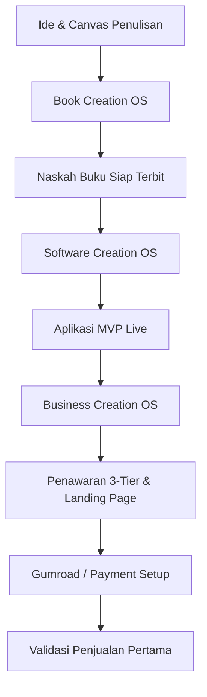

# 📖 Project OS AI — Panduan Dokumentasi Lengkap (v1.0.0)

Selamat datang di Portal Dokumentasi Resmi **Project OS AI**. Dokumen ini dirancang sebagai panduan operasional komprehensif untuk membantu Solo Creator membangun buku, aplikasi, dan bisnis digital dari nol menggunakan kekuatan AI yang terstruktur.

---

## 🗺️ Daftar Isi
1. [Pendahuluan & Filosofi Utama](#-pendahuluan--filosofi-utama)
2. [Peta Alur Kerja (Workflow Map)](#-peta-alur-kerja-workflow-map)
3. [Panduan Modul Deep-Dive](#-panduan-modul-deep-dive)
   - [Modul 01: Book Creation OS](#modul-01-book-creation-os)
   - [Modul 02: Software Creation OS](#modul-02-software-creation-os)
   - [Modul 03: Business Creation OS](#modul-03-business-creation-os)
   - [Modul 04: Knowledge Management OS](#modul-04-knowledge-management-os)
   - [Modul 05: AI Team OS](#modul-05-ai-team-os)
   - [Modul 06: Advanced Project OS](#modul-06-advanced-project-os)
4. [Panduan Eksekusi Prompt Chain](#-panduan-eksekusi-prompt-chain)
5. [Daftar Deliverables & Templates](#-daftar-deliverables--templates)
6. [Protokol Pemulihan & Penanganan Masalah (Recovery Protocol)](#-protokol-pemulihan--penanganan-masalah-recovery-protocol)
7. [Pertanyaan yang Sering Diajukan (FAQ)](#-pertanyaan-yang-sering-diajukan-faq)

---

## 🧠 Pendahuluan & Filosofi Utama

Mayoritas proyek AI gagal bukan karena kecerdasan buatan yang kurang pintar, melainkan karena ketiadaan **sistem alur kerja yang jelas**. Tanpa struktur, interaksi Anda dengan AI akan terjebak dalam obrolan tanpa ujung (*infinite chat loop*).

Project OS AI berdiri di atas 4 filosofi operasional utama:
*   **System > Prompt:** Rangkaian alur kerja terarah jauh lebih penting daripada satu baris perintah instan (*ad-hoc prompt*).
*   **Outcome-Centric:** Setiap modul dirancang untuk menghasilkan output konkret (*deliverables*) dalam hitungan hari.
*   **Context Control:** Menjaga ingatan AI dengan manajemen berkas konteks agar AI tidak mengalami amnesia di tengah proyek.
*   **Revenue Before Complexity:** Mengutamakan peluncuran produk secepat mungkin daripada terjebak dalam *over-engineering* teknis.

---

## 🗺️ Peta Alur Kerja (Workflow Map)

Proyek dijalankan dengan urutan sekuensial yang teruji untuk meminimalisasi risiko kegagalan pasar:

---

## 📁 Panduan Modul Deep-Dive

### Modul 01: Book Creation OS
*   **Tujuan:** Mengubah ide mentah menjadi naskah buku/ebook berkualitas dalam waktu 7 hari.
*   **Langkah Operasional:**
    1.  **Hari 1: Pengisian Book Idea Canvas** – Mengunci nilai tawar utama (*USP*) buku Anda.
    2.  **Hari 2: Profiling Reader Persona** – Memetakan masalah spesifik pembaca target.
    3.  **Hari 3: Penyusunan Book Outline** – Menyusun struktur bab secara sistemik.
    4.  **Hari 4-6: Penulisan Bab Interaktif** – Menggunakan prompt chain untuk menulis draf per bab secara detail.
    5.  **Hari 7: Audit & Finalisasi** – Melakukan penyuntingan tata bahasa dan alur logika.

---

### Modul 02: Software Creation OS
*   **Tujuan:** Membangun aplikasi MVP (Minimum Viable Product) yang fungsional dalam waktu 14 hari tanpa kebingungan menulis kode.
*   **Langkah Operasional:**
    1.  **Definisi Fitur Utama** – Membatasi cakupan (*scope*) agar aplikasi selesai tepat waktu.
    2.  **Rancangan Database Skema** – Menggunakan skema LocalStorage untuk menyimpan data tanpa ribet setup server.
    3.  **Pengembangan UI** – Membangun visual frontend yang bersih dan responsif.
    4.  **Debugging & Pengujian** – Memandu AI untuk menemukan bug dan memperbaikinya secara cepat.

---

### Modul 03: Business Creation OS
*   **Tujuan:** Memvalidasi pasar dan mengamankan transaksi penjualan pertama dalam 10 hari.
*   **Langkah Operasional:**
    1.  **Positioning Canvas** – Memosisikan produk agar menonjol di antara kompetitor.
    2.  **Rancangan Paket 3-Tier** – Menyusun paket Starter, Pro, dan Ultimate.
    3.  **Penyusunan Landing Page** – Menggunakan struktur *Problem-first* untuk menarik perhatian pembeli dalam 5 detik pertama.
    4.  **Penanganan Keberatan (Objection Handling)** – Menyusun daftar jawaban atas 50 keberatan calon pembeli.

---

### Modul 04: Knowledge Management OS
*   **Tujuan:** Menjaga agar riset dan dokumentasi internal tidak tercecer di puluhan tab chat AI yang berbeda.
*   **Langkah Operasional:**
    1.  **Central Truth Directory** – Membuat berkas berindeks seperti `01_PROJECT_BIBLE.md` sebagai sumber kebenaran tunggal proyek.
    2.  **Logging Decisions** – Mencatat setiap keputusan arsitektur penting di `05_DECISION_LOG.md` untuk melacak arah proyek secara transparan.

---

### Modul 05: AI Team OS
*   **Tujuan:** Mendelegasikan tugas spesifik ke persona AI yang tepat layaknya memiliki tim startup profesional.
*   **Daftar Peran Persona AI:**
    *   **AI Coder/Engineer:** Berfokus pada arsitektur kode, perbaikan bug, dan integrasi API.
    *   **AI Copywriter/Marketer:** Berfokus pada konversi landing page, materi email newsletter, dan utas media sosial.
    *   **AI Product Strategist:** Berfokus pada riset pasar, pricing, dan validasi fungsionalitas penawaran.

---

### Modul 06: Advanced Project OS
*   **Tujuan:** Protokol tingkat lanjut saat proyek mengalami jalan buntu atau AI mulai kehilangan arah.
*   **Langkah Operasional:**
    1.  **Context Reset Protocol** – Cara mereset memori chat AI tanpa harus kehilangan progres proyek.
    2.  **Scope Control Checklist** – Metode memotong fitur yang tidak mendesak demi mencegah penundaan rilis.

---

## 🔗 Panduan Eksekusi Prompt Chain

Untuk menggunakan pustaka prompt chain agar menghasilkan output maksimal, ikuti metode 3 langkah berikut:

1.  **Inisialisasi Konteks:** Upload berkas `01_PROJECT_BIBLE.md` ke ruang chat AI Anda (ChatGPT, Claude, atau Gemini).
2.  **Eksekusi Berurutan:** Jalankan prompt chain dari file `PROJECT_OS_OPERATING_SYSTEM.md` langkah demi langkah. Jangan melompati urutan prompt.
3.  **Simpan Output:** Salin hasil terbaik dari AI langsung ke berkas markdown lokal Anda (bukan membiarkannya menumpuk di riwayat chat browser).

---

## 📂 Daftar Deliverables & Templates

Tabel di bawah ini memetakan templat dokumen siap pakai yang disertakan dalam paket:

| Nama Berkas Templat | Tujuan Utama | Letak Folder |
| :--- | :--- | :--- |
| `Book_Idea_Canvas.md` | Mengunci ide pokok buku dan target market | `/Templates/` |
| `Positioning_Canvas.md` | Memetakan keunggulan produk dibanding kompetitor | `/Templates/` |
| `Sprint_Planning_Template.md` | Merencanakan tugas mingguan solo creator | `/Templates/` |
| `SaaS_Database_Blueprints.md` | Blueprint penyimpanan data berbasis LocalStorage | `/Ultimate_Bonuses/` |

---

## 🛠️ Protokol Pemulihan & Penanganan Masalah (Recovery Protocol)

Jika Anda menemui masalah operasional saat pengerjaan proyek:

### Masalah 1: AI Mulai Memberikan Jawaban Berulang/Error
*   **Penyebab:** Konteks obrolan terlalu panjang (*Context Window Exhaustion*).
*   **Solusi:** Buka obrolan (*chat*) baru, lalu unggah kembali berkas `01_PROJECT_BIBLE.md` dan katakan: *"Lanjutkan proyek berdasarkan berkas Project Bible ini mulai dari modul [Sebutkan nama modul]."*

### Masalah 2: Scope Creep (Fitur Aplikasi Terlalu Rumit)
*   **Penyebab:** Mengikuti saran AI tanpa batas sehingga struktur kode menjadi kompleks.
*   **Solusi:** Jalankan prompt *Scope Control* pada modul Advanced OS untuk memangkas fitur sekunder dan fokus hanya pada fungsionalitas inti MVP.

---

## 💬 Pertanyaan yang Sering Diajukan (FAQ)

**Q: Apakah saya harus membayar biaya langganan bulanan untuk Project OS AI?**
A: **Tidak.** Pembelian sistem operasi kerja ini bersifat **Satu Kali Bayar (One-Time Purchase)** untuk akses seumur hidup beserta seluruh pembaruan di masa mendatang.

**Q: Saya bukan seorang programmer, apakah saya bisa menggunakan modul Software OS?**
A: **Bisa.** Modul tersebut dirancang khusus dengan instruksi langkah-demi-langkah bagi pemula agar dapat mengarahkan AI menulis kode HTML, CSS, dan JS secara akurat.

---
*Dokumentasi ini dikelola secara berkala oleh **Youbellkey Yosef Pusli**.*
